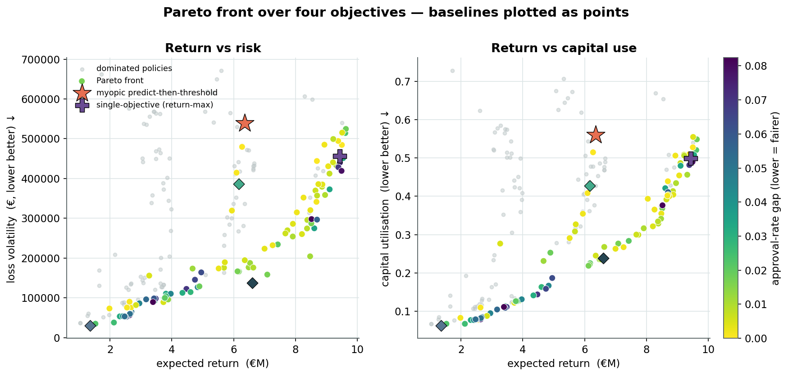
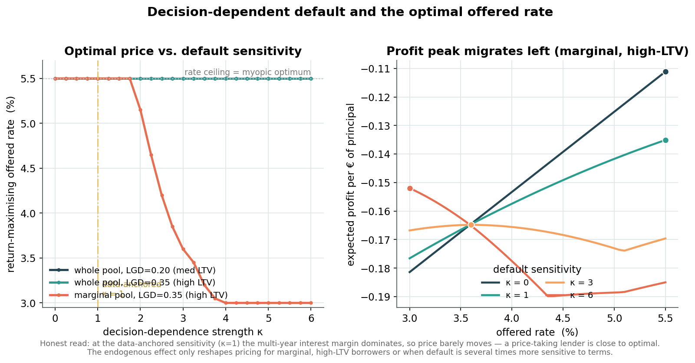
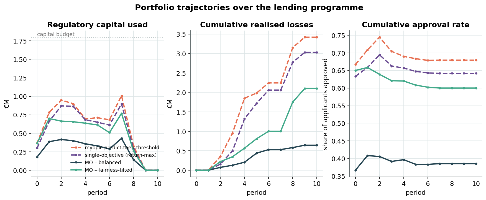
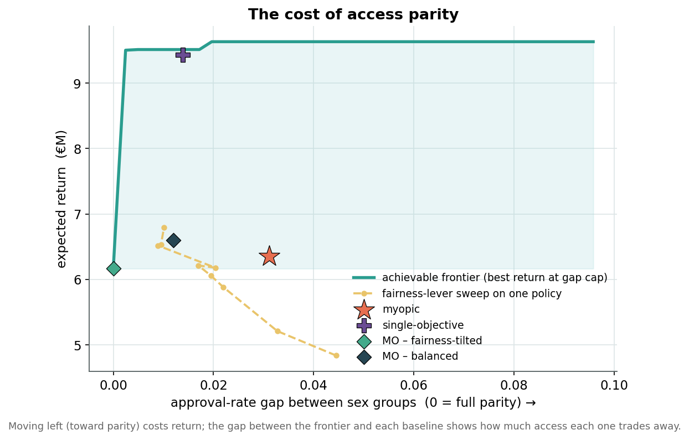
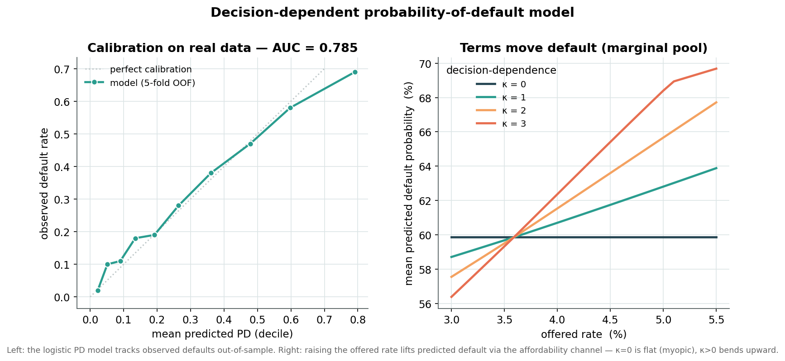

# Lending as a multi-stage, multi-objective decision under endogenous default

**An applied exploration of decision-focused learning, multi-objective sequential
decision-making, and decision-dependent (endogenous) uncertainty — on real credit
data, with honest baselines.**

When a lender sets the terms of a loan — the interest rate, the loan-to-value cap,
the approval threshold — it does not just *select* a borrower of fixed riskiness. It
*changes* that riskiness. A lower rate improves affordability and reduces the chance
of default; it also cuts the margin. So **default probability is endogenous to the
decision**: it depends on the very terms being chosen.

The standard pipeline — *predict default, then decide* — ignores this feedback. It
estimates a default probability as if terms were fixed, then optimises terms against
that frozen estimate. This project asks a simple question:

> **If you model the feedback explicitly, and optimise over several competing
> objectives across time instead of one, do the lending decisions actually change —
> and by how much?**

The answer here is nuanced and, I think, more interesting than a clean "yes":
modelling the feedback changes *who and how much* to lend (access, leverage,
capital) much more than it changes the headline *price*, and a single-objective
optimiser already beats the textbook baseline outright. Details below, including
where the fancy machinery earns nothing.

---

## Why this is genuinely multi-stage, multi-objective, and decision-dependent

* **Decision-dependent.** The terms offered feed an affordability channel that moves
  predicted default — see `figures/pd_model.png`, where raising the offered rate
  lifts default probability (`κ=0` flat = the myopic assumption; `κ>0` bends up).
  The *sensitivity* is a coefficient **estimated from real defaults**, not assumed.
* **Multi-stage.** Applicants arrive over many periods under a finite capital
  budget. Approving a loan ties up regulatory capital until it resolves; realised
  losses erode the capital available to later periods; retained interest rebuilds
  it. Lending greedily early starves later periods — pacing has value.
* **Multi-objective.** A lender juggles **expected return**, **portfolio risk /
  loss volatility**, **regulatory-capital usage**, and **fairness / access** (here,
  approval-rate parity across sex groups). These genuinely conflict, so the output
  is a **Pareto front**, not a single "optimal" policy.

## Real data, properly attributed (never fabricated)

* **Borrower behaviour** — UCI *Statlog (German Credit Data)*: 1,000 real
  consumer-credit records, CC BY 4.0. Drives the PD model.
* **Irish grounding** — real **Central Bank of Ireland** aggregates (mortgage
  arrears 3.5% of accounts, Q2 2025; average new-mortgage rate 3.59%) calibrate the
  *scale* of the simulation. No Irish loan-level data is used or claimed.

Full citations, licences and download dates: [`data/PROVENANCE.md`](data/PROVENANCE.md).

---

## Results

The five figures and the table below are produced end-to-end by `python run_all.py`
(fixed seeds, fully reproducible). Methods: [`METHODS.md`](METHODS.md).

### 1. The Pareto front, with baselines as points


The multi-objective solver maps the trade-off surface; the two baselines land as
single points on it. The myopic predict-then-threshold baseline is **dominated**;
the single-objective optimiser buys high return at the cost of risk and capital.

### 2. The core insight — endogenous default bends the optimal price


As default becomes more responsive to terms (`κ`), the return-maximising rate bends
**below** the ceiling a myopic lender would charge. *Honest read:* at the
data-anchored sensitivity this effect is second-order for pricing — the multi-year
margin dominates a one-off default loss — and only bites for marginal, high-LTV
borrowers or stronger feedback.

### 3. Portfolio trajectories over time


Capital usage, cumulative losses, and approval rate period by period. Greedy
baselines accumulate losses; the paced multi-objective policies stay capital-efficient.

### 4. The cost of access parity


How much expected return you give up to close the approval-rate gap between groups.
Full parity is reachable here at a real but bounded return cost; the baselines sit
at different points on (or below) this frontier.

### 5. The decision-dependent PD model


Calibrated out-of-sample on the real data (left); the offered rate genuinely moves
predicted default through affordability (right).

### Results table

<!-- RESULTS:START -->

| Policy | Return (€M) | Loss vol. (€k) | Loss CVaR95 (€k) | Capital util. | Approval rate | Approval gap | Return/capital |
|---|---|---|---|---|---|---|---|
| Myopic predict-then-threshold | 6.35 | 538 | 4443 | 0.56 | 0.68 | 0.031 | 11.35 |
| Single-objective (return-max) | 9.43 | 456 | 3815 | 0.50 | 0.64 | 0.014 | 18.92 |
| MO — balanced (knee) | 6.60 | 138 | 960 | 0.24 | 0.39 | 0.012 | 27.61 |
| MO — fairness-tilted | 6.16 | 386 | 3098 | 0.43 | 0.60 | 0.000 | 14.44 |
| MO — risk-averse | 1.36 | 30 | 150 | 0.06 | 0.11 | 0.002 | 21.59 |

_Return on capital = expected return / capital utilisation. Loss volatility and CVaR95 are across rollouts. All policies evaluated on the same applicant stream (common random numbers)._

- **Where the multi-objective view helps:** it surfaces trade-offs the baselines never reveal. The fairness-tilted policy closes the approval gap by 100% relative to the single-objective optimiser (to 0.000) while still approving 60% of applicants, at a 35% cost in return. The MO front spans 0.52 of the normalised objective hypervolume, versus 0.02 (single-objective) and 0.00 (myopic) for the baseline points alone.
- **Where the structured search helps even a return-only lender:** the optimised single-objective policy *Pareto-dominates* the myopic predict-then-threshold baseline on all four objectives at once — higher return (€9.4M vs €6.4M), lower loss volatility, lower capital use and a smaller approval gap. The textbook fixed break-even threshold with flat pricing simply leaves money and fairness on the table.
- **Where it merely matches:** on raw expected return the single-objective optimiser is best by construction (€9.4M); the balanced MO policy earns less (€6.6M). A lender who genuinely only cares about return should use the simpler optimiser — the extra machinery buys nothing on that single axis.
- **Where it does not help (honest):** the decision-dependent *pricing* channel is second-order at the data-anchored sensitivity (κ=1) — the multi-year interest margin dominates a one-off default loss, so a price-taking lender is close to optimal on price (see the sensitivity figure). The endogenous-default story matters for *who* and *how much* to lend (access, leverage, capital) far more than for the headline rate.

<!-- RESULTS:END -->

---

## Limitations, and what didn't work

This is a portfolio exploration, not a production system or a novel method. Being
explicit about the soft spots:

* **The decision-dependent *pricing* effect is second-order at the data-anchored
  sensitivity.** With realistic multi-year mortgage margins, the interest a
  surviving loan earns dwarfs a one-off default loss, so the return-maximising rate
  sits near the ceiling even when default responds to terms. A *price-taking* lender
  is close to optimal on price. The endogenous story matters for **access, leverage
  and capital** decisions far more than for the headline rate — which is itself a
  worthwhile, non-obvious finding, but not the dramatic "everything changes" result
  one might hope for. (See figure 2.)
* **A simpler baseline does just as well on its own axis.** On raw expected return,
  the single-objective optimiser is best by construction; the multi-objective
  machinery buys nothing if a lender genuinely cares about only one objective. Its
  value is *exposing the trade-off*, not beating return.
* **The default-sensitivity coefficient is associational, not causal.** It is
  estimated from observational data; we treat it as a transparent, data-anchored
  sensitivity and stress-test it with `κ` rather than claiming a causal rate effect.
* **The data are a proxy.** German consumer credit (pre-1994, n=1,000) stands in for
  mortgage borrower behaviour; the Irish grounding is aggregate calibration only.
  Magnitudes are illustrative.
* **The "fairness" measure is deliberately narrow** — approval-rate parity across a
  binary sex attribute. It is a starting point, not a complete treatment of lending
  fairness, and naive optimisation of it can degenerate into "approve almost no-one"
  (we guard against that when selecting representative policies).
* **The solver is approximate.** Sampling-based search over a low-dimensional,
  interpretable policy class — chosen for transparency over raw performance. A
  richer policy class or a proper multi-objective RL method would likely push the
  front out further; the point here was readability and honest comparison.
* **Capital and LGD dynamics are simplified** Basel-flavoured caricatures, not a
  real regulatory-capital model.

---

## Reproduce it

```bash
pip install -r requirements.txt
python run_all.py          # ~1-2 min; writes figures/ and the results table
```

Each step is independently runnable, e.g. `python -m experiments.run_pareto`.
The raw data is cached in `data/raw/`; nothing fetches the network at run time.

## Repository layout

```
data/        real data (cached), provenance, CBI calibration, loader
model/       decision-dependent probability-of-default model
solver/      generic MDP interface, lending environment, MO solver, baselines, Pareto utils
experiments/ one script per figure + the results table
figures/     generated figures (committed for GitHub Pages)
docs/        index.html for GitHub Pages
run_all.py   reproduce everything with fixed seeds
METHODS.md   the model, the MDP formulation, the solver
```

## Licence and attribution

Code released under the MIT licence. The German Credit data is © its authors under
CC BY 4.0 (see `data/PROVENANCE.md`); Central Bank of Ireland figures are public
statistics, cited there. Please retain attributions if you reuse this.
